# 📚 Content Management API

API REST développée avec Node.js et Express permettant de gérer des **articles** et leurs **auteurs**.

---

## 🚀 Lancer le projet

```bash
node server.js
```

Serveur disponible sur :

```
http://localhost:3000
```

---

## 🧠 Technologies utilisées

* Node.js
* Express
* SQLite (better-sqlite3)

---

## 📂 Structure du projet

```
controllers/
routes/
middlewares/
screenshots/
db.js
server.js
```

---

## 🔗 Endpoints principaux

### 👤 Authors

* GET `/authors`
* GET `/authors/:id`
* POST `/authors`
* GET `/authors/:id/articles`

---

### 📄 Articles

* GET `/articles`
* GET `/articles/:id`
* POST `/articles`
* PUT `/articles/:id`
* DELETE `/articles/:id`

---

## 📸 Screenshots

### 📚 Articles

#### 🔹 GET /articles

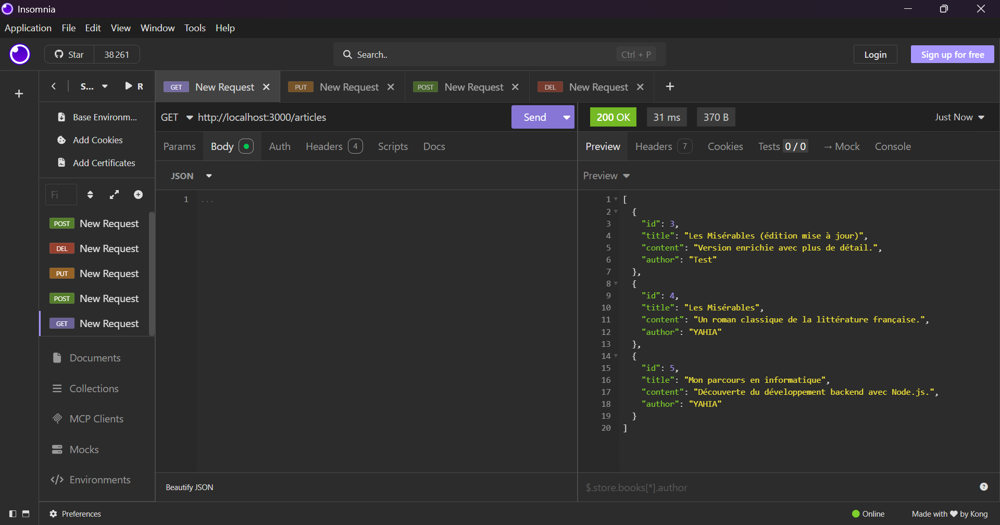

#### 🔹 POST /articles (succès)

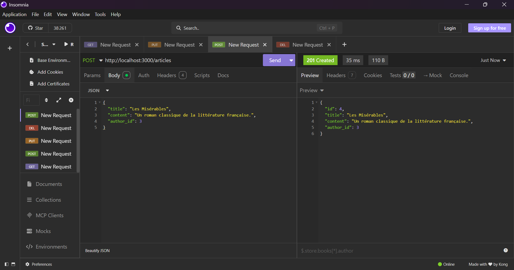

#### 🔹 POST /articles (titre obligatoire)

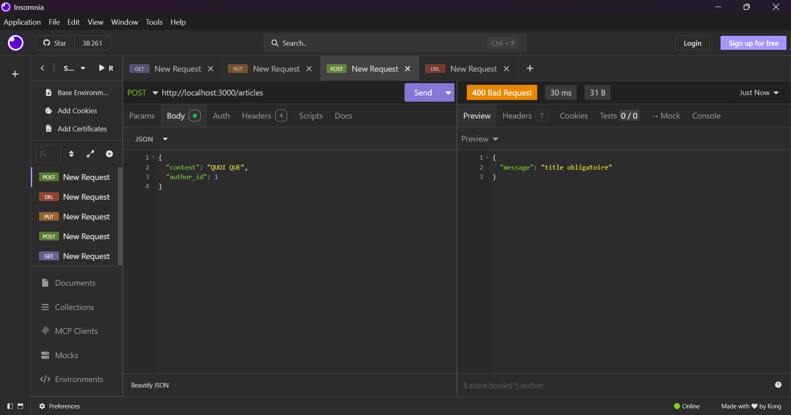

#### 🔹 POST /articles (auteur invalide)

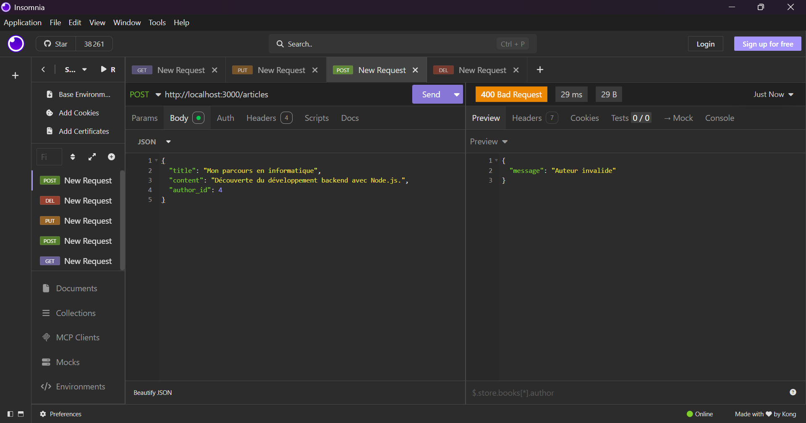

#### 🔹 PUT /articles/:id

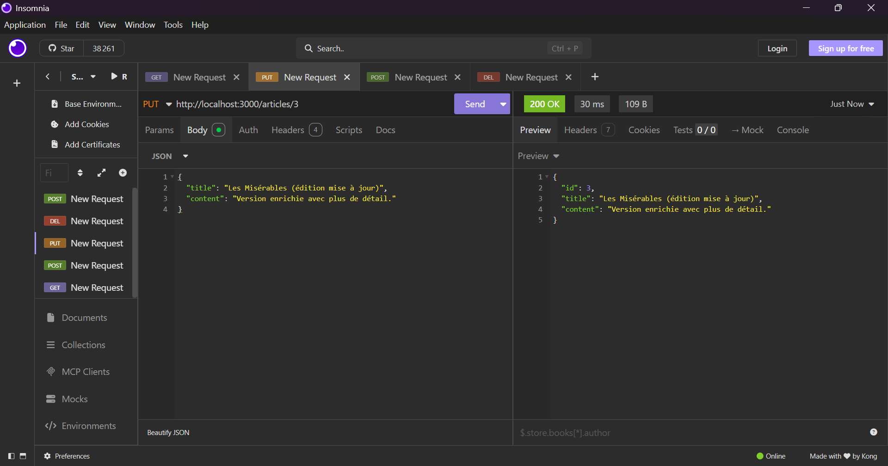

#### 🔹 DELETE /articles/:id

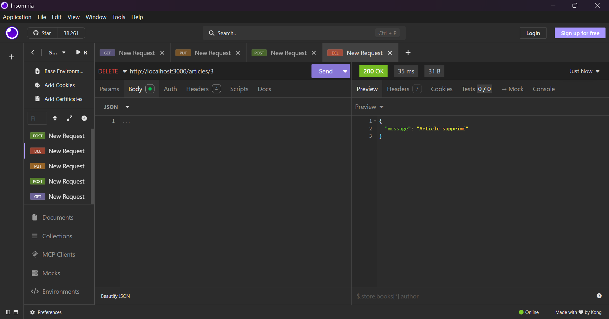

---

### 👤 Authors

#### 🔹 GET /authors

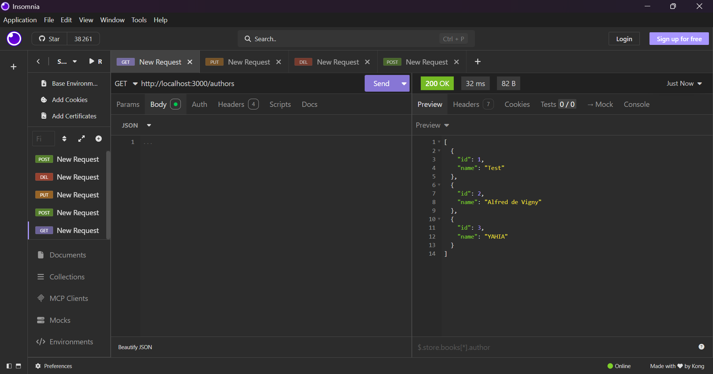

#### 🔹 GET /authors/:id

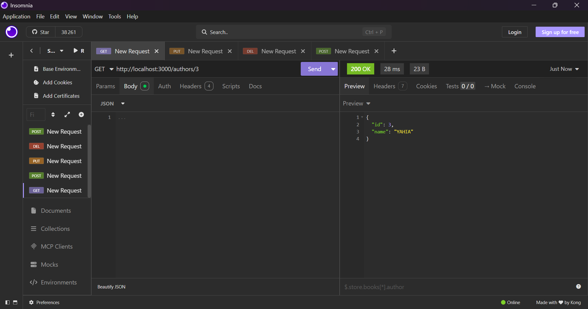

#### 🔹 GET /authors/:id (erreur)

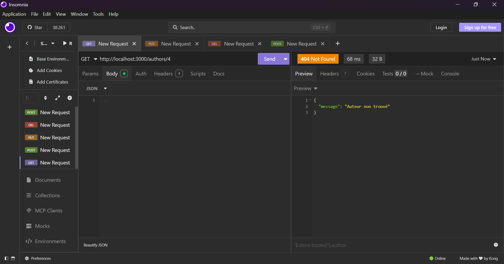

#### 🔹 GET /authors/:id (inexistant)

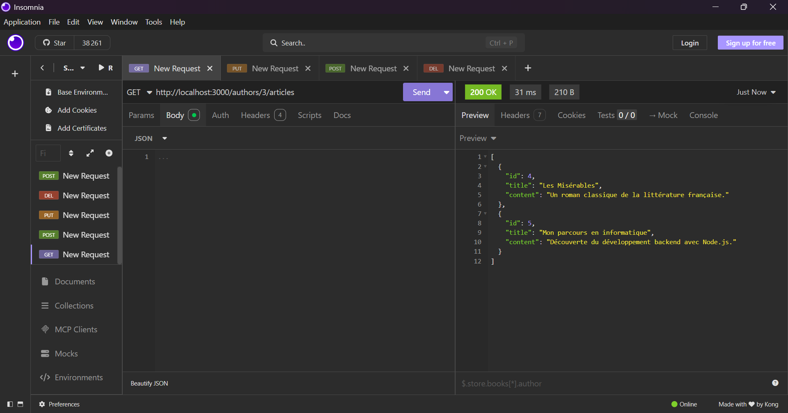

#### 🔹 GET /authors/:id/articles


#### 🔹 POST /authors

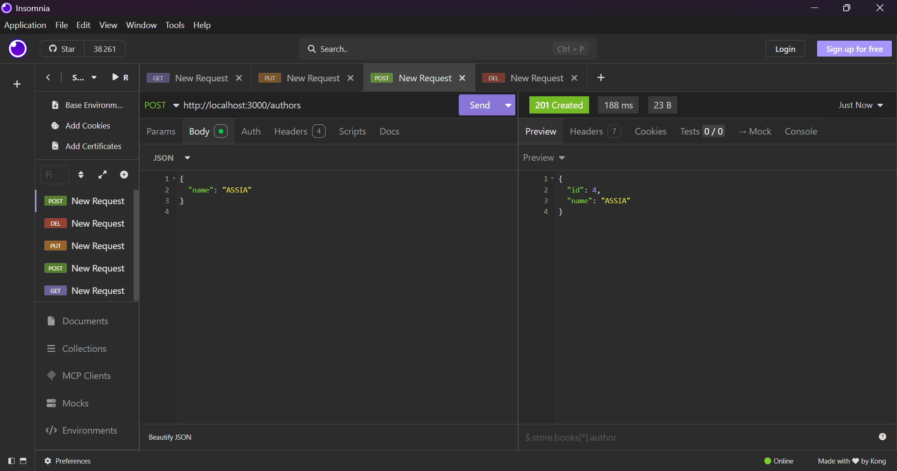

#### 🔹 POST /authors (name obligatoire)

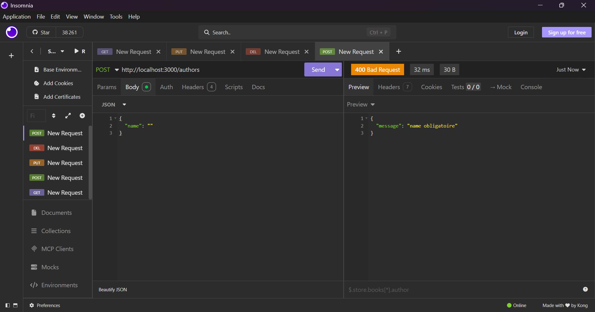

---

## ✅ Fonctionnalités

* CRUD complet pour les articles
* Gestion des auteurs
* Relation articles ↔ auteurs
* Validation des champs
* Gestion des erreurs (400, 404, 500)
* Middleware de logs

---

## 👨‍💻 Auteur

Projet réalisé par **Yahia**
